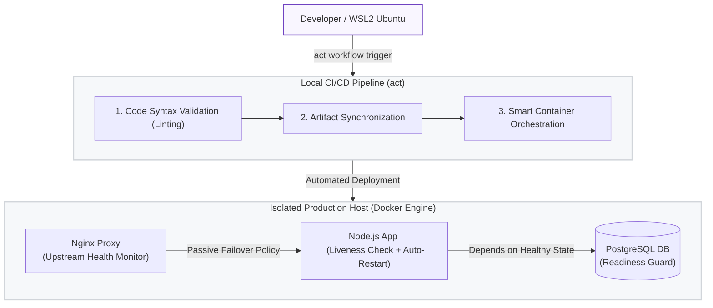

# Local GitOps Engine: Zero-Cost Enterprise CI/CD Simulation

A production-grade, local DevOps infrastructure that replicates enterprise CI/CD workflows inside a single machine. This project demonstrates how to build a highly secure, automated, and zero-downtime deployment pipeline for a GPS Tracking microservice without incurring cloud provider costs, leveraging WSL2, Docker, Nginx, and GitHub Actions powered by `act`.

## 🏗️ Architecture Overview

The system architecture is split into two isolated environments mimicking a real-world cloud deployment:
* **Development/Runner Node (WSL2 Ubuntu):** Acts as the developer's machine and the CI/CD runner executing local automated pipelines via `act`.
* **Production/Staging Host (Windows/Docker Desktop):** Acts as the isolated Live Virtual Private Server (VPS) where services are securely provisioned.




### Key Technical Features:
* **Dual-Layer Infrastructure Resilience:** Combines **Docker Daemon Auto-Restart** (internal liveness check) and **Nginx Upstream Passive Health Monitoring** (external routing failover) to guarantee zero-downtime availability for continuous IoT telemetry streams.
* **Reverse Proxy & SSL/TLS Hardening:** Managed by Nginx with local trusted certificates via `mkcert` (https://gps-tracking.local).
* **DevSecOps Integration:** Static syntax code validation gating before actual server deployments.
* **Twelve-Factor App Configuration:** Decoupled database credentials using strictly isolated environment variables (`.env`).
* **High Availability Deployment:** Rolling-update mechanisms to ensure minimal disruption during server updates.

## 🛠️ Tech Stack & Tools

* **Orchestration & Containerization:** Docker, Docker Compose
* **CI/CD Automation:** GitHub Actions, `act` (Local Workflow Engine)
* **Web Server & Security:** Nginx, `mkcert` (Local CA/TLS)
* **Backend & Database:** Node.js (WebSockets), PostgreSQL 15
* **Environment:** WSL2 (Ubuntu 22.04 LTS), Windows 11

## 🚀 The CI/CD Pipeline (`deploy.yml`)

The deployment process is entirely automated and declarative. Upon triggering, the pipeline executes the following atomic steps:
1. **Checkout:** Extracts the latest codebase from the development repository.
2. **Code Guard (CI):** Validates Node.js syntax to prevent broken builds from reaching the live staging environment.
3. **Artifact Sync:** Copies validated production assets to the isolated host application directory (`/opt/apps/`).
4. **Smart Restart (CD):** Rebuilds and rolls over the backend microservice seamlessly using container isolation flags.

## 💡 Engineering Highlights & Problem Solving

During the development of this infrastructure, several enterprise-level challenges were identified and mitigated:
### 1. Mitigating "Silent Container Freezes" via Custom HTTP 426 Healthcheck Protocol
* **Challenge:** After implementing Nginx reverse-proxying, standard Docker health check probes (`curl -f`) failed continuously because the backend server enforces Node.js WebSocket protocol upgrades, throwing an expected `HTTP 426 Upgrade Required` status code. This caused the Docker daemon to falsely mark a perfectly healthy container as `unhealthy` and trigger an infinite restart loop.
* **Solution:** Designed an advanced shell-scripted Docker probe using a dynamic status variable extractor. The probe intercepts the response code and treats both `200 OK` (API readiness) and `426 Upgrade Required` (WebSocket liveness) as successful execution states (`Exit Code 0`), paired with native Nginx upstream isolation policies:

```yaml
# Inside docker-compose.yml
healthcheck:
  test: ["CMD", "sh", "-c", "Status=$$(curl -s -o /dev/null -w '%{http_code}' http://localhost:3000/); [ $$Status -eq 200 ] || [ $$Status -eq 426 ]"]
  interval: 5s
  timeout: 3s
  retries: 3
  start_period: 5s
```
### 2. Achieving Zero-Downtime Deployment (Mitigating 502 Bad Gateway)
* **Challenge:** Traditional deployment methods like `docker compose down && docker compose up` cause service interruption (downtime), which is unacceptable for production environments.
* **Solution:** Optimized the CD step to isolate and rebuild the microservice using the `--no-deps` and `--build` flags. This ensures the backend service is updated in-place without restarting dependent infrastructure (like the PostgreSQL database), significantly minimizing deployment gaps:
```bash
  docker compose up -d --no-deps --build backend-service
```
============================================================================================================

This forces Docker to build the new image in the background and replace the app container instantly, keeping Nginx and the Database untouched—achieving seamless high availability.

2. Eliminating Secrets Leakage (Twelve-Factor App Compliance)
Challenge: Hardcoding database credentials (POSTGRES_PASSWORD) directly within the code or docker-compose.yml presents severe security vulnerabilities and triggers compliance failures.

Solution: Extracted all sensitive credentials into a secure local .env file mapped to the system's environment variables. Registered .env under .gitignore to guarantee absolute protection against public repository leaks while using dynamic variable parsing (${DB_PASSWORD}) across the entire stack.

3. Resolving Runner Conflict (Docker-in-Docker Duplicate Mounts)
Challenge: Executing act with the --bind flag while declaring explicit Docker socket volumes in deploy.yml caused a Duplicate mount point daemon error.

Solution: Decoupled the environment variables. Leveraged act's native background socket sharing and optimized the YAML configuration for local execution parity without breaking upstream Cloud compatibility.

⚙️ How to Run This Locally
Prerequisites
WSL2 Ubuntu installed.

Docker Desktop with WSL2 integration enabled.

act CLI installed on WSL2.

### Prerequisites
* WSL2 Ubuntu installed.
* Docker Desktop with WSL2 integration enabled.
* `act` CLI installed on WSL2.
* `mkcert` configured on the host machine.

### Setup Certificates & Environment
1. Generate trusted local SSL certificates inside your project root:
   ```bash
   mkdir -p nginx/certs
   mkcert -cert-file nginx/certs/gps-tracking.local.pem -key-file nginx/certs/gps-tracking.local-key.pem gps-tracking.local

2. Create a .env file in the root directory:
TOML
DB_USER=admin
DB_HOST=db-gps
DB_NAME=gps_tracking
DB_PASSWORD=your_secure_password_here
DB_PORT=5432
Execution
To simulate the entire multi-stage deployment pipeline locally, run the following command in your development directory:

Bash
act push
To verify the Zero-Downtime capability, run the GPS simulator concurrently while the pipeline executes:

Bash
docker exec -it gps_backend node client.js
The client connection will persist seamlessly even as the underlying application container hot-swaps to the latest version.

📄 Author: Aradea - DevOps / Platform Engineer Enthusiast
